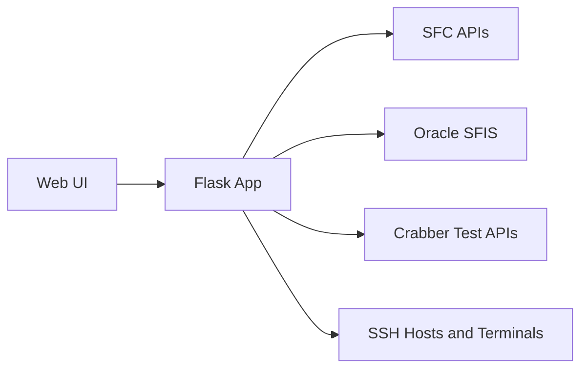

# SFC_View

Internal Flask platform that consolidated **20+ fragmented web/desktop tools** into **one application** for **24 users** across L10/L11 Testing and FA teams.

## Why This Project Matters

- Single toolchain for daily test/debug operations (instead of scattered apps)
- Standardized terminology and UX for faster onboarding
- Faster triage and less manual coordination between teams
- Optimized flows for high-frequency debug and automated test execution

## Impact Snapshot

- **Users:** 24 (L10/L11 Testing + FA)
- **Tool consolidation:** 20+ legacy tools -> 1 platform
- **Outcome:** faster, clearer, and more repeatable daily test/debug workflows

## Portfolio Visual Walkthrough

Add screenshots to `docs/showcase/` and keep these references so recruiters can scan the product quickly.

| Area | What it shows | Image |
|---|---|---|
| Analytics | Time-window query, summaries, drill-down, export | `docs/showcase/01-analytics-dashboard.png` |
| Bonepile | Upload + disposition workflow | `docs/showcase/02-bonepile-disposition.png` |
| ETF Status | Live room/tray visibility | `docs/showcase/03-etf-status.png` |
| Testing / FA Debug | Online/Offline test operations | `docs/showcase/04-testing-online-modal.png` |
| L10 Queue | Per-fixture queue, cooldown, force controls | `docs/showcase/05-l10-queue.png` |
| Debug Terminal | In-browser SSH terminal (xterm/WebSocket) | `docs/showcase/06-fa-debug-terminal.png` |

Recommended screenshot style:
- Use dark/light theme consistently across all shots
- Crop to highlight key workflow elements
- Keep sensitive data anonymized (SNs, IPs, credentials, user names)

## Key Pages and Functions

- **Analytics Dashboard**: Query SFC fail data by time range, view tray/SKU/test-flow summaries, drill into SN details, and export reports.
- **Bonepile**: Upload and parse NV workbooks, then generate disposition statistics and SN lists.
- **ETF Status**: Live room/tray monitoring backed by SFC tray/fixture data.
- **FA Debug Home**: Authenticated entry point with page-level permissions for engineering tools.
- **Repair**: SFIS/Oracle-backed repair checks and actions.
- **Testing**: Online/offline test flows with Crabber integration.
- **L10 Test**: Fixture/slot status dashboard with per-fixture online-test queue, cooldown control, and force-run actions.
- **IT Kitting SQL**: Controlled kitting/debug SQL operations.

## Architecture (High-Level)



## Tech Stack

- **Backend:** Flask, Blueprint architecture, REST-style JSON APIs
- **Frontend:** Jinja templates, JavaScript, xterm/WebSocket terminal integration
- **Data/Systems:** SFC APIs, Oracle/SFIS queries, SQLite auth/session store
- **Testing/Automation:** Crabber online/offline test orchestration, queue control for L10 fixtures

## Recruiter Notes

SFC_View demonstrates end-to-end server engineering for manufacturing test operations: service integration, workflow automation, role-based access control, realtime operational UIs, and developer-friendly diagnostics in one maintainable platform.

## Local Run

```bash
pip install -r requirements.txt
python app.py
```

Open `http://localhost:5556` (or port from `FLASK_PORT`).

## Configuration

- `config/app_config.py` for Flask and app-level paths/settings
- `config/analytics_config.json` for pass rules and analytics behavior
- `config/debug_config.py` for FA debug, SSH, and Crabber settings
- `config/etf_config.py` for ETF polling and tray status settings

## Selected APIs

- `POST /api/query` - Analytics query by date/time range
- `POST /api/error-stats` - Error analysis
- `POST /api/export` - CSV/XLSX exports
- `GET /api/sfc/tray-status` - SFC tray status proxy for ETF
- `GET /api/debug/l10-test/status` - L10 fixture/slot status
- `POST /api/debug/l10-test/online-queue/*` - L10 online-test queue controls
